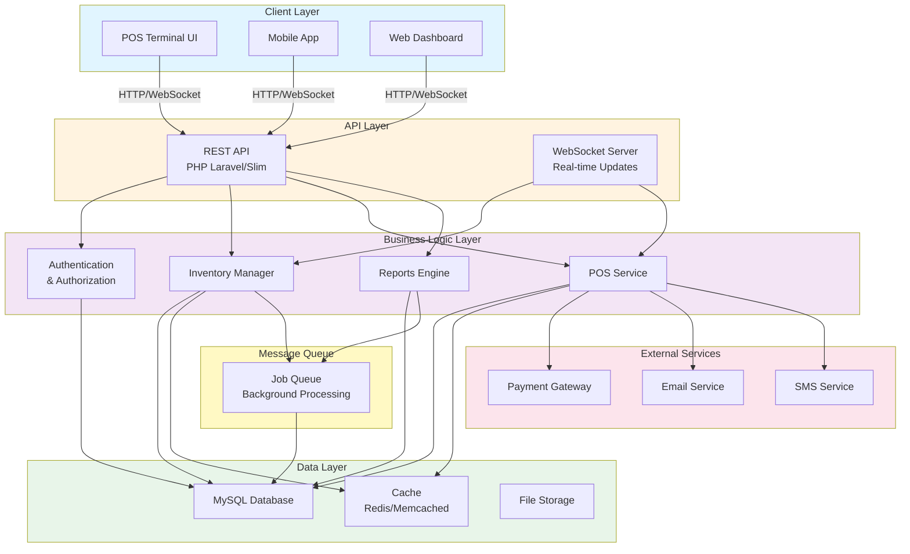

# Real-Time POS Inventory System - Architecture Overview

## System Architecture

## Architecture Components

### Client Layer
- **POS Terminal UI**: Desktop/touchscreen interface for point-of-sale operations
- **Mobile App**: Mobile application for inventory management and order processing
- **Web Dashboard**: Administrative dashboard for reporting and system monitoring

### API Layer
- **REST API**: Primary API interface for all client applications (PHP-based)
- **WebSocket Server**: Real-time bidirectional communication for live inventory updates

### Business Logic Layer
- **Authentication & Authorization**: User management and access control
- **Inventory Manager**: Stock tracking, product management, and stock level monitoring
- **POS Service**: Transaction processing, sales operations, and point-of-sale handling
- **Reports Engine**: Analytics, reporting, and business intelligence

### Data Layer
- **MySQL Database**: Primary persistent data storage
- **Cache**: In-memory caching (Redis/Memcached) for performance optimization
- **File Storage**: Document and receipt storage

### External Services
- **Payment Gateway**: Integration for payment processing
- **Email Service**: Transactional email notifications
- **SMS Service**: SMS alerts and notifications

### Message Queue
- **Job Queue**: Asynchronous background job processing for heavy operations

## Data Flow

1. **Client Request**: Clients send HTTP/WebSocket requests to the API layer
2. **API Processing**: REST API routes requests to appropriate business logic handlers
3. **Business Logic**: Services process requests, implement business rules
4. **Data Access**: Services interact with database and cache layers
5. **Response**: API returns processed data back to clients
6. **Real-time Updates**: WebSocket pushes live inventory updates to connected clients

## Key Features

- Real-time inventory synchronization across multiple terminals
- Asynchronous background job processing for heavy operations
- Caching strategy for improved performance
- Integration with external payment and notification services
- Comprehensive reporting and analytics capabilities
