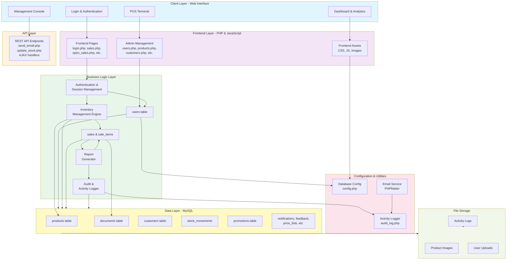

# MTECH UGANDA - Real-Time POS Inventory System Architecture

## Table of Contents
1. [System Overview](#system-overview)
2. [Architecture Diagram](#architecture-diagram)
3. [Backend Structure](#backend-structure)
4. [Frontend Structure](#frontend-structure)
5. [Database Schema](#database-schema)
6. [API Endpoints](#api-endpoints)
7. [Frontend Pages & Components](#frontend-pages--components)
8. [Technology Stack](#technology-stack)
9. [Security Architecture](#security-architecture)

---

## System Overview

MTECH UGANDA is a comprehensive real-time Point of Sale (POS) and Inventory Management System designed for retail and wholesale businesses. The system provides multi-user support with role-based access control, real-time inventory tracking, advanced reporting, and comprehensive management tools.

### Key Features
- **Real-time Inventory Management**: Live stock tracking across multiple terminals
- **Multi-User System**: Role-based access control (Admin, Manager, Cashier)
- **Complete POS System**: Sales transactions, receipts, and payment handling
- **Advanced Reporting**: Sales analysis, inventory reports, and business intelligence
- **Security**: Password history, audit logging, and session management
- **Customer Management**: Database with purchase history and loyalty tracking
- **Promotional Tools**: Dynamic pricing, discounts, and special offers

---

## Architecture Diagram



---

## Backend Structure

### Directory Organization

```
project-root/
├── public/                           # Web-accessible directory
│   ├── index.php                     # Application entry point
│   ├── login.php                     # Login page & authentication
│   ├── logout.php                    # Logout handler
│   ├── config.php                    # Database & app configuration
│   ├── startup.php                   # Main dashboard/welcome page
│   ├── welcome.php                   # Welcome & dashboard logic
│   ├── sales.php                     # Sales transaction page
│   ├── open_sales.php                # View open/pending sales
│   ├── cash_operations.php           # Cash management page
│   ├── credit-payments.php           # Credit payment management
│   ├── end-of-day.php                # End of day reconciliation
│   ├── feedback.php                  # User feedback interface
│   ├── forgot-password.php           # Password recovery
│   ├── password-history.php          # Password change history
│   ├── update-password.php           # Password update handler
│   ├── update-profile.php            # User profile update
│   ├── user-info.php                 # User information page
│   ├── get_customer_invoices.php     # Customer invoice retrieval
│   ├── print_receipt.php             # Receipt printing handler
│   │
│   ├── api/                          # API endpoints
│   │   ├── send_email.php            # Email sending API
│   │   └── update_stock.php          # Stock update API
│   │
│   ├── management/                   # Admin management panel
│   │   ├── dashboard.php             # Admin dashboard
│   │   ├── users.php                 # User management
│   │   ├── add_user.php              # Add new user
│   │   ├── edit_user.php             # Edit user details
│   │   ├── check_username.php        # Username validation
│   │   ├── reset_password.php        # Reset user password
│   │   ├── products.php              # Product management (120KB)
│   │   ├── stock.php                 # Stock management (69KB)
│   │   ├── customers-suppliers.php   # Dual customer/supplier management (60KB)
│   │   ├── customers.php             # Customer management (30KB)
│   │   ├── price-lists.php           # Price list management
│   │   ├── credit-payments.php       # Credit payment management
│   │   ├── company.php               # Company settings (35KB)
│   │   ├── profile.php               # User profile management (53KB)
│   │   ├── security.php              # Security settings (22KB)
│   │   ├── reports.php               # Report generation (50KB)
│   │   ├── documents.php             # Document management (32KB)
│   │   ├── notifications.php         # Notification management
│   │   │
│   │   ├── includes/                 # Management module includes
│   │   ├── ajax/                     # AJAX handlers for management
│   │   ├── js/                       # JavaScript for management UI
│   │   └── uploads/                  # Upload directory
│   │
│   ├── includes/                     # Shared PHP includes
│   ├── css/                          # CSS stylesheets
│   ├── js/                           # JavaScript files
│   ├── assets/                       # Static assets
│   └── uploads/                      # User upload directory
│
├── includes/                         # Backend includes & utilities
│   ├── config.php                    # Configuration with MySQLi
│   ├── activity_logger.php           # User activity logging
│   ├── audit_log.php                 # Audit trail logging
│   ├── email_functions.php           # Email utility functions
│   └── PHPMailer/                    # Email library
│
├── database/                         # Database files & migrations
├── logs/                             # Application logs
├── composer.json                     # PHP dependencies
├── config.php                        # Root configuration
├── database_setup.php                # Database initialization script
├── database_setup.sql                # Database schema (12KB SQL)
├── create_password_history_table.php # Password history table setup
├── run_migration.php                 # Database migration runner
└── test_email.php                    # Email testing utility
```

### Backend Key Files & Functionality

#### Authentication & Session Management
- **login.php** (24KB): Handles user authentication with password validation
- **logout.php**: Clears session and redirects to login
- **config.php**: PDO database connection with error handling

#### Core Business Operations
- **startup.php** (49KB): Dashboard initialization and main business logic
- **sales.php** (31KB): POS transaction creation and management
- **open_sales.php** (27KB): View and manage pending/open sales
- **cash_operations.php** (18KB): Cash drawer and register management
- **credit-payments.php** (19KB): Credit payment tracking and processing
- **end-of-day.php** (22KB): Daily reconciliation and reporting

#### User & Security Management
- **user-info.php** (22KB): User profile display and management
- **password-history.php** (9KB): View password change history
- **update-password.php**: Update user password securely
- **update-profile.php**: Update user profile information
- **forgot-password.php** (20KB): Password recovery process

#### Management Console (Admin Panel)
- **dashboard.php** (41KB): Admin dashboard with KPIs and charts
- **users.php** (51KB): User management with CRUD operations
- **products.php** (120KB): Comprehensive product management
- **stock.php** (69KB): Stock management and adjustments
- **customers.php** (30KB): Customer/supplier management
- **reports.php** (50KB): Advanced reporting engine
- **security.php** (22KB): Security settings and policies
- **company.php** (35KB): Company information management
- **price-lists.php**: Price list creation and management
- **documents.php** (32KB): Document management system

#### API Endpoints
- **send_email.php**: Email sending API with PHPMailer
- **update_stock.php**: Stock update endpoint for real-time updates

#### Backend Utilities
- **activity_logger.php** (5.7KB): User activity tracking
- **audit_log.php** (5.9KB): Comprehensive audit trail
- **email_functions.php** (3.8KB): Centralized email utilities

---

## Frontend Structure

### Frontend Pages & User Interfaces

#### Customer-Facing Pages
- **login.php**: Authentication interface with form validation
- **sales.php**: Main POS interface for creating sales transactions
- **open_sales.php**: View and manage incomplete sales
- **cash_operations.php**: Cash drawer operations
- **credit-payments.php**: Credit payment settlements
- **end-of-day.php**: Daily reconciliation summary
- **feedback.php**: User feedback submission
- **print_receipt.php**: Receipt printing handler

#### User Self-Service Pages
- **user-info.php**: User profile and account information
- **update-profile.php**: Edit profile details
- **update-password.php**: Change password form
- **password-history.php**: View password change history
- **forgot-password.php**: Password recovery process

#### Admin/Management Pages
- **dashboard.php**: Executive overview with analytics
- **users.php**: User listing, creation, and management
- **products.php**: Product catalog management
- **stock.php**: Inventory tracking and adjustments
- **customers.php**: Customer database management
- **reports.php**: Comprehensive business reporting
- **price-lists.php**: Pricing strategy management
- **security.php**: System security configuration

### Frontend Assets

#### CSS (public/css/)
- Bootstrap or custom styling
- Responsive design for all devices
- Print-friendly styles for receipts and reports

#### JavaScript (public/js/)
- Form validation and user interactions
- AJAX calls for real-time updates
- Chart libraries for reporting (Chart.js, etc.)
- Data tables for product/customer lists
- Modal dialogs and pop-ups

#### Static Assets (public/assets/)
- Logo and company branding
- Icons and images
- Fonts and typography resources

#### Management UI (public/management/)
- Separate admin theme
- Advanced data tables
- Drag-and-drop interfaces
- Real-time notification system

---

## Database Schema

### Core Tables

#### Users & Security
```sql
users
  - id (INT, Primary Key)
  - username (VARCHAR 50, UNIQUE)
  - password (VARCHAR 255, hashed)
  - name (VARCHAR 100)
  - email (VARCHAR 100)
  - role (ENUM: admin, manager, cashier)
  - active (TINYINT Boolean)
  - created_at (TIMESTAMP)

user_password_history
  - id (INT, Primary Key)
  - user_id (INT, Foreign Key → users)
  - username (VARCHAR 50)
  - password_hash (VARCHAR 255)
  - changed_at (DATETIME)
  - changed_by (INT)
  - ip_address (VARCHAR 45)
  - user_agent (VARCHAR 255)
  - Indexes: user_id, changed_at, user_id+changed_at
```

#### Products & Categories
```sql
categories
  - id (INT, Primary Key)
  - name (VARCHAR 100)
  - description (TEXT)
  - parent_id (INT, Self-referencing for subcategories)
  - active (TINYINT Boolean)

tax_rates
  - id (INT, Primary Key)
  - name (VARCHAR 100)
  - rate (DECIMAL 5,2)
  - active (TINYINT Boolean)

products
  - id (INT, Primary Key)
  - code (VARCHAR 50, UNIQUE)
  - barcode (VARCHAR 50)
  - name (VARCHAR 255)
  - description (TEXT)
  - category_id (INT, Foreign Key → categories)
  - unit_of_measure (VARCHAR 20)
  - price (DECIMAL 10,2)
  - tax_rate_id (INT, Foreign Key → tax_rates)
  - tax_included (TINYINT Boolean)
  - cost (DECIMAL 10,2)
  - stock_quantity (DECIMAL 10,2)
  - min_stock (DECIMAL 10,2) - Low stock alert level
  - image_path (VARCHAR 255)
  - active (TINYINT Boolean)
  - created_at, updated_at (TIMESTAMP)
```

#### Customers & Companies
```sql
customers
  - id (INT, Primary Key)
  - name (VARCHAR 255)
  - type (ENUM: customer, supplier, both)
  - tax_number (VARCHAR 100)
  - address (VARCHAR 255)
  - city (VARCHAR 100)
  - postal_code (VARCHAR 20)
  - country (VARCHAR 100)
  - phone (VARCHAR 50)
  - email (VARCHAR 100)
  - contact_person (VARCHAR 100)
  - notes (TEXT)
  - discount_percent (DECIMAL 5,2)
  - active (TINYINT Boolean)
  - created_at, updated_at (TIMESTAMP)

company
  - id (INT, Primary Key)
  - name (VARCHAR 255)
  - tax_number (VARCHAR 100)
  - street_name, building_number (VARCHAR)
  - district, city, state_province, country (VARCHAR)
  - postal_code (VARCHAR 20)
  - phone_number (VARCHAR 50)
  - email (VARCHAR 255)
  - bank_account (VARCHAR 255)
  - bank_acc_number (VARCHAR 100)
  - logo_path (VARCHAR 255)
```

#### Sales & Transactions
```sql
sales
  - id (INT, Primary Key)
  - customer_id (INT, Foreign Key → customers)
  - user_id (INT, Foreign Key → users)
  - invoice_number (VARCHAR 50, UNIQUE)
  - date (DATETIME)
  - total_amount (DECIMAL 12,2)
  - payment_type (ENUM: cash, card, mobile_money, credit)
  - payment_status (ENUM: pending, partial, paid, refunded)
  - tax_amount (DECIMAL 10,2)
  - discount_amount (DECIMAL 10,2)
  - notes (TEXT)
  - created_at, updated_at (TIMESTAMP)
  - Indexes: invoice_number, date, customer_id, user_id

sale_items
  - id (INT, Primary Key)
  - sale_id (INT, Foreign Key → sales)
  - product_id (INT, Foreign Key → products)
  - quantity (DECIMAL 10,2)
  - unit_price (DECIMAL 10,2)
  - tax_rate_id (INT, Foreign Key → tax_rates)
  - tax_amount (DECIMAL 10,2)
  - discount_amount (DECIMAL 10,2)
  - subtotal (DECIMAL 12,2)
  - created_at (TIMESTAMP)
  - Indexes: sale_id, product_id
```

#### Documents & Inventory
```sql
documents
  - id (INT, Primary Key)
  - document_number (VARCHAR 50)
  - document_type (ENUM: invoice, receipt, order, quote, credit_note, delivery_note)
  - document_date (DATETIME)
  - customer_id (INT, Foreign Key → customers)
  - user_id (INT, Foreign Key → users)
  - cash_register_id (INT, Foreign Key → cash_registers)
  - order_number (VARCHAR 50)
  - paid_status (ENUM: paid, unpaid, partial, cancelled)
  - discount (DECIMAL 10,2)
  - total (DECIMAL 10,2)
  - notes (TEXT)
  - created_at (TIMESTAMP)

stock_movements
  - id (INT, Primary Key)
  - product_id (INT, Foreign Key → products)
  - document_id (INT, Foreign Key → documents)
  - type (ENUM: in, out, adjustment)
  - quantity (DECIMAL 10,2)
  - notes (TEXT)
  - user_id (INT, Foreign Key → users)
  - created_at (TIMESTAMP)
```

#### Pricing & Promotions
```sql
price_lists
  - id (INT, Primary Key)
  - name (VARCHAR 255)
  - description (TEXT)
  - is_default (TINYINT Boolean)
  - active (TINYINT Boolean)
  - created_at, updated_at (TIMESTAMP)

price_list_items
  - id (INT, Primary Key)
  - price_list_id (INT, Foreign Key → price_lists)
  - product_id (INT, Foreign Key → products)
  - price (DECIMAL 10,2)
  - UNIQUE: (price_list_id, product_id)

promotions
  - id (INT, Primary Key)
  - name (VARCHAR 255)
  - description (TEXT)
  - start_date (DATE)
  - end_date (DATE)
  - active_days (VARCHAR 50) - e.g., '1,2,3,4,5,6,7'
  - discount_type (ENUM: percentage, fixed_amount)
  - discount_value (DECIMAL 10,2)
  - min_purchase_amount (DECIMAL 10,2)
  - min_purchase_qty (INT)
  - apply_to (ENUM: all, specific_products)
  - active (TINYINT Boolean)
  - created_at, updated_at (TIMESTAMP)

promotion_products
  - id (INT, Primary Key)
  - promotion_id (INT, Foreign Key → promotions)
  - product_id (INT, Foreign Key → products)
  - UNIQUE: (promotion_id, product_id)
```

#### System & User Activity
```sql
cash_registers
  - id (INT, Primary Key)
  - name (VARCHAR 100)
  - location (VARCHAR 255)
  - active (TINYINT Boolean)

notifications
  - id (INT, Primary Key)
  - user_id (INT, Foreign Key → users) - NULL for broadcast
  - title (VARCHAR 255)
  - message (TEXT)
  - type (ENUM: info, success, warning, danger)
  - is_read (TINYINT Boolean)
  - related_url (VARCHAR 255)
  - created_at (TIMESTAMP)

feedback
  - id (INT, Primary Key)
  - user_id (INT, Foreign Key → users)
  - subject (VARCHAR 255)
  - message (TEXT)
  - rating (TINYINT) - 1-5 stars
  - status (ENUM: new, in_progress, resolved)
  - created_at, updated_at (TIMESTAMP)
```

---

## API Endpoints

### Email API

#### POST /public/api/send_email.php
**Purpose**: Send transactional emails (receipts, notifications, password resets)

**Parameters**:
- `to` (string): Recipient email address
- `subject` (string): Email subject
- `body` (string/HTML): Email content
- `type` (string): Email type (receipt, notification, password_reset)

**Response**:
```json
{
  "success": true,
  "message": "Email sent successfully"
}
```

**Implementation**: Uses PHPMailer library with SMTP configuration

---

### Stock Management API

#### POST /public/api/update_stock.php
**Purpose**: Update product stock levels in real-time

**Parameters**:
```json
{
  "product_id": 123,
  "quantity": 50,
  "type": "in|out|adjustment",
  "document_id": 456,
  "notes": "Stock adjustment"
}
```

**Response**:
```json
{
  "success": true,
  "new_stock": 150,
  "message": "Stock updated successfully"
}
```

**Features**:
- Real-time inventory updates
- Automatic low-stock alerts
- Stock movement tracking and audit trail

---

### AJAX Handlers (public/management/ajax/)

Common AJAX endpoints for dynamic operations:
- User management (add, edit, delete)
- Product operations (search, filter, bulk update)
- Customer management
- Stock adjustments
- Report generation
- Price list updates

---

## Frontend Pages & Components

### Page Structure Template

Most pages follow this structure:
```php
<?php
// 1. Session & Authentication Check
require_once('config.php');
check_user_session();
check_user_role();

// 2. Handle Form Submissions & AJAX Requests
if ($_SERVER['REQUEST_METHOD'] == 'POST') {
    // Validate input
    // Process data
    // Redirect or return JSON
}

// 3. Fetch Data from Database
// Load products, customers, etc.

// 4. Page Header & Navigation
include_once('header.php');

// 5. Page-Specific HTML & Forms

// 6. Footer & Scripts
include_once('footer.php');
?>
```

### Key Frontend Components

#### Sales Module (sales.php)
- **Product Search**: Barcode scanning and product lookup
- **Shopping Cart**: Add/remove items, apply discounts
- **Customer Selection**: Select or create customer
- **Payment Processing**: Handle multiple payment methods
- **Receipt Generation**: Print or email receipt
- **Real-time Updates**: Live stock updates

#### Management Dashboard (dashboard.php)
- **KPI Cards**: Sales, inventory, customer metrics
- **Charts & Graphs**: Sales trends, product performance
- **Quick Actions**: Fast access to common operations
- **Recent Activities**: Latest transactions and changes
- **Alerts**: Low stock, pending payments, notifications

#### Product Management (products.php)
- **Product Table**: List, filter, sort products
- **Add/Edit Forms**: Create and modify products
- **Bulk Operations**: Import/export, bulk pricing
- **Stock Management**: View and adjust stock levels
- **Category Organization**: Organize by category
- **Image Upload**: Product image management

#### User Management (users.php)
- **User Table**: List all users with roles
- **CRUD Operations**: Create, read, update, delete users
- **Role Assignment**: Admin, Manager, Cashier roles
- **Status Control**: Activate/deactivate users
- **Password Management**: Reset user passwords
- **Activity Tracking**: Monitor user actions

#### Customer Management (customers.php)
- **Customer Database**: Full customer directory
- **Search & Filter**: Quick customer lookup
- **Purchase History**: View customer transactions
- **Contact Information**: Manage customer details
- **Credit Management**: Track customer credit
- **Discount Assignment**: Customer-specific pricing

#### Reporting (reports.php)
- **Sales Reports**: Daily, weekly, monthly, yearly
- **Inventory Reports**: Stock levels and movements
- **Profitability Analysis**: Gross profit, margins
- **Product Performance**: Top sellers, slow movers
- **Customer Analytics**: Purchase patterns, loyalty
- **Export Options**: PDF, CSV, Excel formats

---

## Technology Stack

### Backend
- **PHP 7.4+**: Server-side language
- **MySQL/MariaDB 5.7+**: Relational database
- **PDO & MySQLi**: Database abstraction layers
- **PHPMailer**: Email library for transactional emails
- **TCPDF**: PDF generation for receipts and reports

### Frontend
- **HTML5**: Semantic markup
- **CSS3**: Styling and responsive design
- **JavaScript ES6+**: Client-side interactivity
- **Bootstrap**: Responsive CSS framework
- **jQuery** (optional): DOM manipulation
- **Chart.js** (likely): Data visualization
- **DataTables** (likely): Interactive tables

### Development Tools
- **Composer**: PHP dependency manager
- **Git**: Version control
- **XAMPP/WAMP**: Local development environment
- **Netlify**: Deployment (netlify.toml present)

### Browser Support
- Google Chrome (latest)
- Mozilla Firefox (latest)
- Microsoft Edge (latest)
- Safari (latest)

---

## Security Architecture

### Authentication & Authorization

#### Session Management (config.php)
```php
- Cookie-based sessions
- HTTP-only cookies (prevents XSS access)
- Secure cookies (HTTPS only in production)
- SameSite=Strict (prevents CSRF)
- Session ID regeneration every 30 minutes
- Automatic logout after inactivity (1 hour default)
```

#### Password Security
```php
- Bcrypt hashing (cost: 10)
- Password history tracking
- Password change audit trail
- Prevents reuse of recent passwords
- Secure password reset via email
```

#### Role-Based Access Control (RBAC)
```
Admin
  ├── Full system access
  ├── User management
  ├── System configuration
  └── Comprehensive reporting

Manager
  ├── Sales management
  ├── Inventory management
  ├── Customer management
  └── Reports (filtered)

Cashier
  ├── POS operations
  ├── View own transactions
  └── Limited reports
```

### Data Protection

#### Input Validation & Sanitization
```php
- sanitize() function: htmlspecialchars, strip_tags, trim
- PDO prepared statements (prevent SQL injection)
- File upload validation
- CSRF token validation on forms
```

#### Database Security
```sql
- Character set: utf8mb4 (Unicode support)
- Foreign key constraints
- Indexed key fields for performance
- Automatic timestamps for audit trails
- Default CURRENT_TIMESTAMP on updates
```

#### Audit & Activity Logging

**activity_logger.php**:
- Tracks user actions (login, logout, transactions)
- Records IP address and user agent
- Timestamps all activities
- Searchable activity history

**audit_log.php**:
- Comprehensive audit trails
- Document change tracking
- User modification tracking
- Complete history preservation

### Error Handling & Logging

#### PHP Error Logging (config.php)
```php
error_reporting(E_ALL);
display_errors = 0 (in production)
log_errors = 1
error_log = php_errors.log
```

#### Database Error Handling
```php
PDO::ATTR_ERRMODE = PDO::ERRMODE_EXCEPTION
Custom error messages for users
Detailed errors logged server-side
Graceful failure messages
```

### Security Best Practices

1. **File Permissions**: 755 for directories, 644 for files
2. **Upload Directory**: Writable but not executable
3. **Configuration Files**: Outside web root where possible
4. **Database Credentials**: In config.php (not in version control)
5. **HTTPS**: Enabled in production (secure cookies)
6. **Regular Updates**: Keep PHP and libraries current
7. **Database Backups**: Regular automated backups
8. **Access Logs**: Monitor and audit access patterns

---

## Installation & Setup

### Prerequisites
1. PHP 7.4+ with PDO, MySQLi, OpenSSL, cURL, GD
2. MySQL 5.7+ or MariaDB 10.2+
3. Web Server (Apache/Nginx)
4. Composer (for dependency management)

### Database Setup
```bash
1. Create database: CREATE DATABASE `mtech-uganda`;
2. Import schema: mysql -u root mtech-uganda < database_setup.sql
3. Configure database in config.php
4. Run migrations: php run_migration.php
```

### Application Setup
```bash
1. Extract files to web server root
2. Set permissions: chmod 755 public
3. Create uploads directory: mkdir -p public/uploads
4. Update database credentials in config.php
5. Run composer: composer install
6. Access application: http://localhost/project
```

### Testing
- Database connection: php public/test_db.php
- Email configuration: php test_email.php
- TCPDF setup: Test PDF generation from reports

---

## Performance Optimization

### Database Optimization
- Indexed key fields for faster queries
- Prepared statements to prevent query compilation overhead
- Connection pooling (if using persistent connections)
- Query optimization for large datasets

### Frontend Optimization
- Minified CSS/JS files
- Image compression and optimization
- Lazy loading for product images
- Caching strategies for static assets
- Asynchronous API calls with AJAX

### Real-time Updates
- AJAX polling for inventory updates
- WebSocket potential for future scalability
- Efficient database queries with proper indexing
- Caching of frequently accessed data

---

## Deployment Considerations

### Environment Configuration
```
Development: display_errors = 1, error_log = php_errors.log
Production: display_errors = 0, error_log = /var/log/php_errors.log
              Secure cookies enabled, HTTPS required
```

### Scaling Considerations
- Database replication for high-traffic scenarios
- Caching layer (Redis) for frequently accessed data
- Load balancing across multiple servers
- CDN for static assets
- API rate limiting for external integrations

---

## Version Information
- **Current Version**: 1.1.0 (Development)
- **Last Updated**: June 2025
- **PHP Requirement**: 7.4+
- **MySQL Requirement**: 5.7+

---

## Support & Contact
- **Email**: mugishamicheal24@gmail.com
- **Phone**: +256 768 432 509
- **Website**: https://www.mtechuganda.com

---

## License
This software is proprietary and confidential. Unauthorized copying, distribution, modification, public display, or public performance is strictly prohibited.
